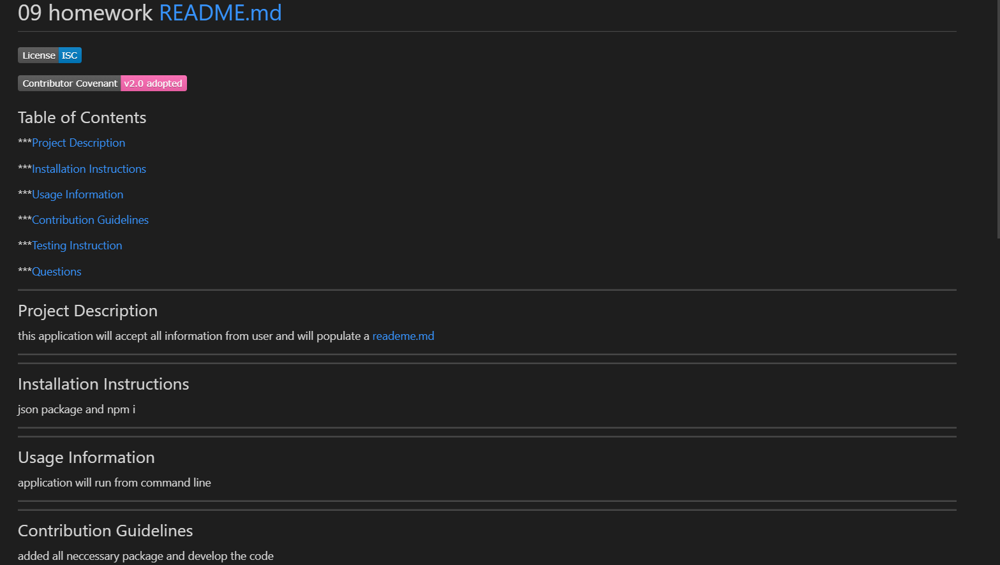
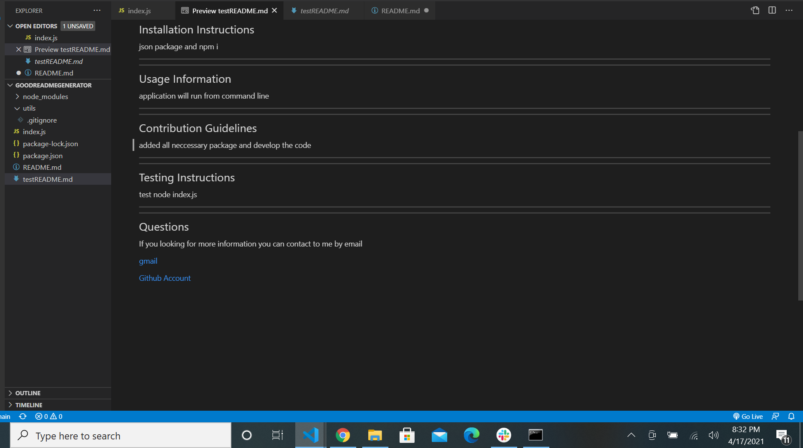
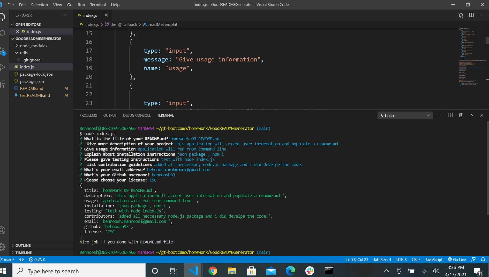

# 09 Node.js Homework: Professional README Generator

## Your Task

The application will be invoked by using the following command:

```bash
node index.js
```

Because this application won’t be deployed, I  provide a link to a walkthrough video that demonstrates its functionality. 


## User Story

```md
AS A developer
I WANT a README generator
SO THAT I can quickly create a professional README for a new project
```

## Screenshots




## Demonstration
[Demo](https://drive.google.com/file/d/1fygVdj8RzihhdWCYzHpIKQO_0EY-X0wm/view)

## QUESTIONS

[Github Link](https://github.com/Behnoosh93/goodREADMEGenerator)

[Email](mailto:behnoosh.mahmoodi@gmail.com?)